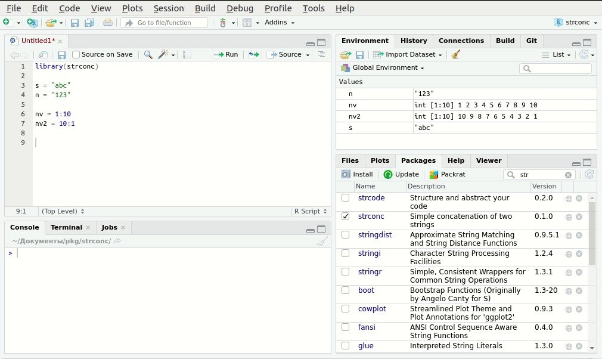

```{r setup, include = FALSE}
knitr::opts_chunk$set(
  collapse = TRUE,
  comment = "#>"
)
```

## How to use

Simple concatenation of two strings using the %+% operator. The package has an add-in for Rstudio, for a quick insert %+%.



